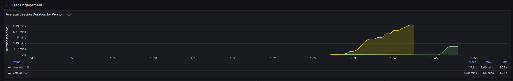

# Continuous Experimentation Plan

## Experiment Overview
**Goal**: Compare user engagement between two versions of the sentiment analysis application by measuring average session duration with different UI/UX approaches.

## Hypothesis
We believe that the new version (v2) with improved UI will lead to longer user sessions compared to the basic version (v1), indicating better user engagement.

## Metric
**Average Session Duration**
- Metric name: `session_duration_seconds`
- Prometheus query: `avg(session_duration_seconds) by (version)`
- Target: 20% increase in average session duration for v2
- Measurement: Time between first and last request in a user session

## Version Differences
1. **Version 1 (Control - Basic UI)**:
   - Simple text input field
   - Basic text output + emoji for sentiment result
   - Minimal styling
   - No animations or visual feedback

2. **Version 2 (Experiment - Enhanced UI)**:
   - Polished input field with placeholder text
   - Visual sentiment indicators (emojis/icons)
   - Smooth loading animations
   - Better visual feedback for user actions
   - Modern, attractive styling

## Experiment Design

### Traffic Distribution
- Use Istio's traffic splitting:
  - 90% of traffic to v1 (control)
  - 10% of traffic to v2 (experiment)

### Implementation
1. **Deployment**
   - Both versions run simultaneously
   - Each version exposed through the same service
   - Traffic split managed by Istio VirtualService
   - Session tracking implemented in both versions

2. **Monitoring**:
   - Grafana dashboard with session duration panels
   - Real-time monitoring of average durations
   - Version comparison visualizations

## Success Criteria
The experiment will be considered successful if:
1. Version 2 shows ≥20% longer average session duration
2. The difference is statistically significant (p < 0.05)
3. No technical issues affecting measurement accuracy

## Analysis Method
1. Compare average session durations between versions
2. Statistical significance testing
3. Distribution analysis of session lengths
4. Identify any time-based patterns

## Reporting
Grafana dashboard showing:
1. Real-time average session duration by version
2. Historical trends
3. Statistical significance indicators

## Experiment Results

Below is a screenshot of the Grafana dashboard showing the comparison of average session duration between version 1.1.5 (control) and version 2.0.3 (experiment):

Based on the metrics captured in this visualization, we can determine whether version 2.0.3 achieves the target of a 20% increase in average session duration compared to version 1.1.5.

## Notes
- Focus solely on session duration as engagement metric
- Ensure accurate session tracking implementation
- Account for timezone differences in analysis
- Consider implementing session timeout handling 