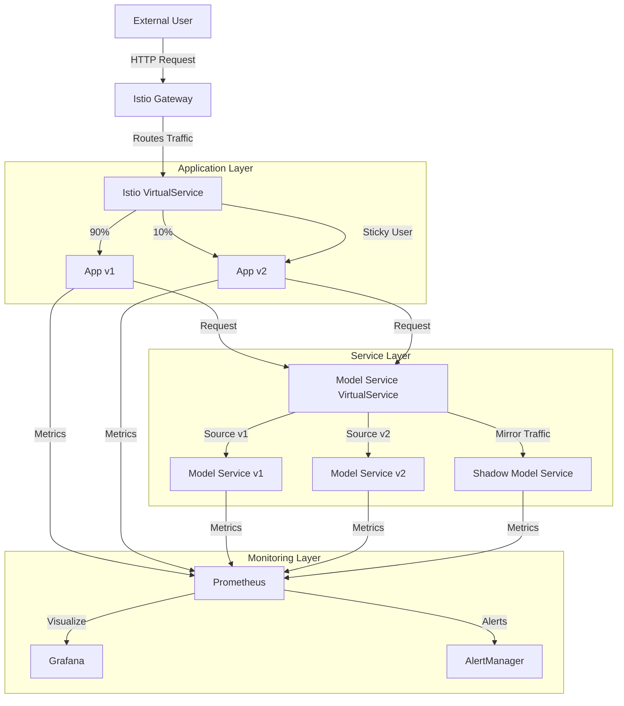
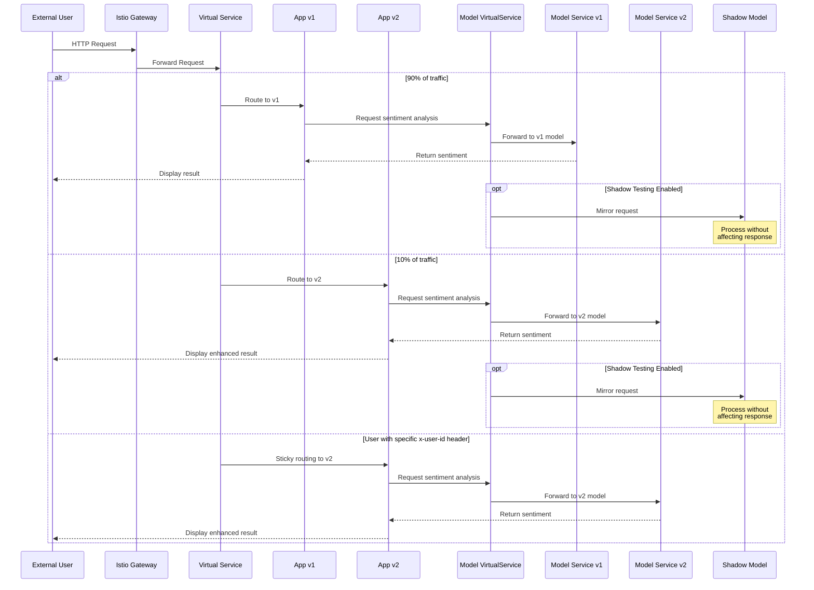

# Deployment Documentation

## Overview

This document outlines the deployment structure and data flow of our sentiment analysis application. The system is deployed on Kubernetes with Istio service mesh to enable advanced traffic routing capabilities for continuous experimentation. Our architecture follows microservices principles with distinct components that work together to provide sentiment analysis functionality.

## Deployment Structure

Our deployment consists of several key components that form a complete service mesh:

### Key Components:

1. **Gateway Layer**:
   - **Istio Gateway**: Entry point for all external traffic, providing HTTP routing
   - **Virtual Service**: Manages traffic splitting and routing rules

2. **Application Layer**:
   - **App v1**: Original version of the sentiment analysis application
   - **App v2**: Experimental version with enhanced UI for better user engagement
   
3. **Service Layer**:
   - **Model Service v1**: Original sentiment analysis model service
   - **Model Service v2**: Experimental model service
   - **Shadow Model Service**: Optional deployment for shadow testing (traffic mirroring)

4. **Monitoring Layer**:
   - **Prometheus**: Collects and stores metrics from all services
   - **Grafana**: Provides dashboards for visualization of metrics
   - **AlertManager**: Handles alerting based on defined rules

## Data Flow

### External Request Flow

### Dynamic Traffic Routing

Our deployment implements several dynamic traffic routing mechanisms:

1. **A/B Testing (90/10 Split)**:
   - 90% of incoming traffic is routed to App v1 (control)
   - 10% of incoming traffic is routed to App v2 (experiment)
   - This split is defined in the Istio VirtualService for the application

2. **Sticky Routing**:
   - Users with a specific `x-user-id` header are always routed to App v2
   - This ensures consistent experience for test users
   - Implemented through header-based routing rules in the VirtualService

3. **Version-Aware Backend Routing**:
   - App v1 pods are automatically routed to Model Service v1
   - App v2 pods are automatically routed to Model Service v2
   - This routing is based on source pod labels and defined in the Model Service VirtualService

4. **Shadow Testing (Optional)**:
   - When enabled, requests to any version of the Model Service are mirrored to a Shadow Model Service
   - Allows testing of new model implementations without affecting user experience
   - Can be configured to mirror a specific percentage of traffic

## Resource Relationships

All resources in our deployment are interconnected through Kubernetes services and Istio routing rules:

1. **Service Selection**:
   - Services select pods based on labels (app and version)
   - This allows traffic to be directed to specific versions of each component

2. **Istio DestinationRules**:
   - Define subsets for each service (v1, v2, shadow)
   - Each subset corresponds to a specific version of the application or model service

3. **Configuration**:
   - ConfigMaps provide environment-specific configuration
   - Secrets store sensitive information like SMTP credentials for alerts

## Monitoring and Observability

Our deployment includes comprehensive monitoring:

1. **Metrics Collection**:
   - All pods expose Prometheus metrics
   - ServiceMonitors collect these metrics for analysis
   - Custom metrics track user session duration for experimental analysis

2. **Visualization**:
   - Grafana dashboards visualize key metrics including:
     - Application performance
     - Traffic distribution between versions
     - Experiment metrics (session duration)

3. **Alerting**:
   - PrometheusRules define alert conditions
   - AlertManager sends notifications via email when thresholds are exceeded

## Conclusion

This deployment structure enables continuous experimentation through careful traffic routing and comprehensive monitoring. The separation of application and model services, combined with version-aware routing, allows us to test new features and implementations with minimal risk.

The current experiment focuses on comparing user engagement between different UI implementations by measuring session duration, with traffic split 90/10 between versions. For detailed information about the experimental design, please refer to our [Continuous Experimentation Plan](continuous-experimentation.md). 