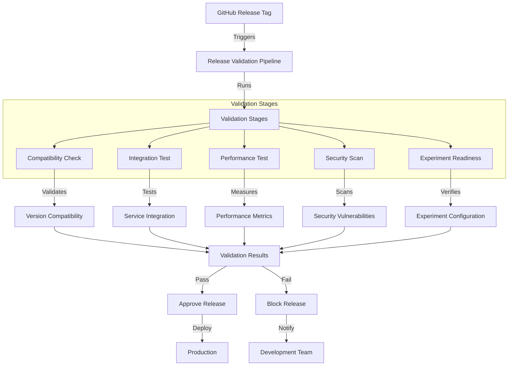

# Extension Proposal: Automated Release Validation Pipeline

## Identified Shortcoming: Manual Release Validation Process

Our current release process lacks an automated validation mechanism to ensure that new releases meet quality standards before being deployed to production. As noted by [Dynatrace](https://www.dynatrace.com/news/blog/what-is-release-validation/), manual release validation "increases the risk of missing a serious issue or being unable to respond in real time" and "simply does not scale for today's modern cloud-native environments that are based on microservices-based architectures where new releases occur more frequently from days to hours to minutes."

This shortcoming manifests in several ways:

1. **Inconsistent Release Quality**: Without automated validation, we rely on manual testing which can be error-prone and inconsistent across team members.

2. **Delayed Issue Detection**: Problems that could be caught early in the release process are often discovered only after deployment, leading to:
   - Increased time-to-fix
   - Potential service disruptions
   - Higher operational costs
   - Negative user experience

3. **Limited Experimentation Confidence**: Our current continuous experimentation setup (90/10 traffic split) lacks automated validation of experiment readiness, which could lead to:
   - Deploying experiments with undetected issues
   - Inaccurate experiment results due to technical problems
   - Wasted resources on invalid experiments

4. **Manual Coordination Overhead**: The current process requires manual coordination between team members for:
   - Version compatibility checks
   - Integration testing
   - Performance validation
   - Security scanning

## Proposed Extension: Release Validation Pipeline

Our proposed extension consits of implementing an automated Release Validation Pipeline (RVP) that integrates with our existing CI/CD infrastructure to validate releases before they are deployed to production. Following [Dynatrace's recommendations](https://www.dynatrace.com/news/blog/what-is-release-validation/), this pipeline would implement quality gates - "benchmarks in the SDLC that define specific, measurable, and achievable success criteria that a service must meet before advancing to the next phase."

The pipeline would run a series of automated checks and tests to ensure release quality, addressing the critical need for validation at every stage of the software development lifecycle (SDLC), not just in pre-production.

### Architecture



### Implementation Details

1. **Compatibility Check Stage**:
   - Validates version compatibility between components
   - Ensures all dependencies are properly specified
   - Checks for breaking changes in APIs
   - Verifies Helm chart compatibility
   - Implements quality gates for component verification

2. **Integration Test Stage**:
   - Deploys the release to a staging environment
   - Runs end-to-end tests
   - Validates service communication
   - Tests Istio routing rules
   - Performs post-release monitoring as recommended by [Dynatrace](https://www.dynatrace.com/news/blog/what-is-release-validation/)

3. **Performance Test Stage**:
   - Measures response times under load
   - Validates resource usage
   - Ensures performance meets SLOs
   - Compares against baseline metrics

4. **Security Scan Stage**:
   - Scans container images for vulnerabilities
   - Checks for exposed secrets
   - Validates network policies
   - Reviews RBAC configurations

5. **Experiment Readiness Stage**:
   - Validates experiment configuration
   - Ensures metrics collection is properly set up
   - Verifies traffic routing rules
   - Tests monitoring integration

### Implementation Plan

1. **GitHub Actions Workflow**:
   ```yaml
   name: Release Validation Pipeline
   
   on:
     release:
       types: [created]
   
   jobs:
     validate-release:
       runs-on: ubuntu-latest
       steps:
         - name: Checkout code
           uses: actions/checkout@v3
           
         - name: Set up validation environment
           run: |
             # Setup validation environment
             
         - name: Run compatibility checks
           run: |
             # Run compatibility validation
             
         - name: Run integration tests
           run: |
             # Deploy to staging and run tests
             
         - name: Run performance tests
           run: |
             # Execute performance tests
             
         - name: Run security scans
           run: |
             # Execute security scans
             
         - name: Validate experiment readiness
           run: |
             # Verify experiment configuration
             
         - name: Generate validation report
           run: |
             # Create validation report
             
         - name: Approve or block release
           if: success()
           run: |
             # Approve release for deployment
           else:
             # Block release and notify team
   ```

2. **Validation Dashboard**:
   - Create a Grafana dashboard to visualize validation results
   - Track validation metrics over time
   - Monitor release quality trends

3. **Automated Notifications**:
   - Configure Slack notifications for validation results
   - Send detailed reports to the development team
   - Alert on critical issues

## Measuring Success

To evaluate whether this extension successfully addresses the identified shortcoming, we can design an experiment with the following metrics, incorporating [Dynatrace's validation framework](https://www.dynatrace.com/news/blog/what-is-release-validation/):

1. **Release Quality Metrics**:
   - Number of post-deployment issues
   - Time to detect issues
   - Number of rollbacks
   - User-reported problems
   - Validation results against service-level objectives (SLOs)

2. **Process Efficiency Metrics**:
   - Time saved in manual validation
   - Reduction in release coordination meetings
   - Number of automated validations vs. manual checks

3. **Experiment Quality Metrics**:
   - Percentage of experiments with technical issues
   - Accuracy of experiment results
   - Time to identify experiment problems

### Experiment Design

1. **Control Group**: Current manual validation process
2. **Treatment Group**: Automated Release Validation Pipeline
3. **Duration**: 3 months
4. **Success Criteria**:
   - 50% reduction in post-deployment issues
   - 70% reduction in time spent on manual validation
   - 90% of releases passing automated validation
   - Zero critical security issues in validated releases

## External Sources

1. **GitHub Actions Documentation**:
   - [GitHub Actions for CI/CD](https://docs.github.com/en/actions/guides/about-continuous-integration)
   - [GitHub Actions for Release Management](https://docs.github.com/en/actions/guides/about-continuous-delivery)

2. **Kubernetes Best Practices**:
   - [Kubernetes Release Management](https://kubernetes.io/docs/concepts/workloads/controllers/deployment/#rolling-update-deployment)
   - [Istio Release Management](https://istio.io/latest/docs/ops/best-practices/security/#release-management)

3. **Research Papers**:
   - "Continuous Delivery: Reliable Software Releases through Build, Test, and Deployment Automation" by Jez Humble and David Farley
   - "The DevOps Handbook" by Gene Kim, Jez Humble, Patrick Debois, and John Willis

4. **Industry Blogs**:
   - [Google's Release Engineering Practices](https://cloud.google.com/architecture/devops/devops-tech-release-automation)
   - [Netflix's Release Validation](https://netflixtechblog.com/how-we-build-code-at-netflix-c5d9bd727f15)

## Conclusion

The proposed Release Validation Pipeline addresses a critical shortcoming in our current release process by automating validation steps and ensuring consistent quality across releases. As emphasized by [Dynatrace](https://www.dynatrace.com/news/blog/what-is-release-validation/), "automating release validation can improve the overall delivery speed without sacrificing the quality of software" and "help identify release issues quicker and prevent bad code from progressing to production."

By implementing this extension, we can:
- Improve release quality through automated quality gates
- Reduce manual overhead and approval bottlenecks
- Increase confidence in our experimentation process
- Enable real-time issue detection and response
- Scale our validation process to match our microservices architecture

The solution is general in nature and can be adapted to other projects beyond our specific implementation. The automated validation approach can be customized for different types of applications and deployment strategies, making it a valuable addition to any release engineering practice. 